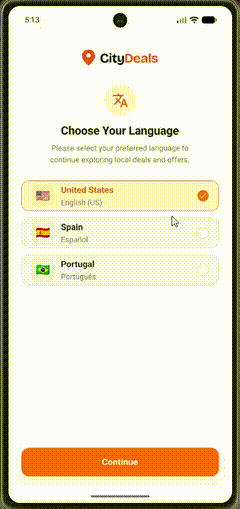
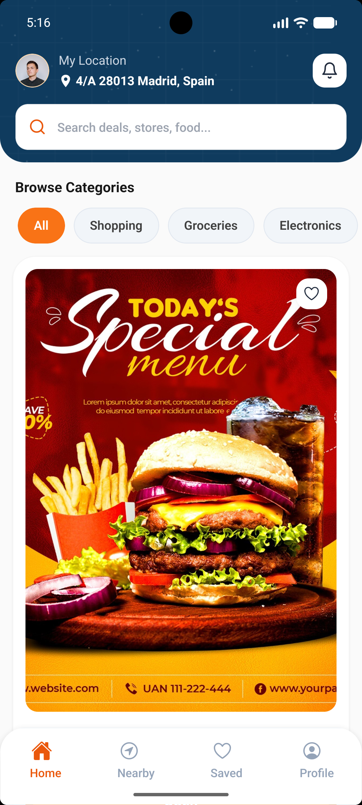
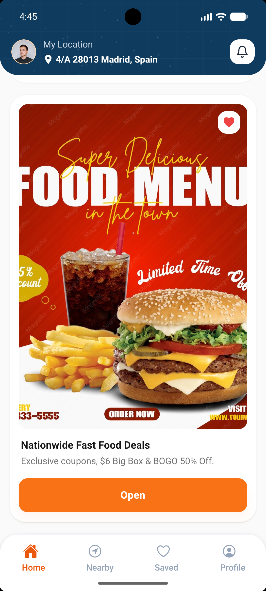
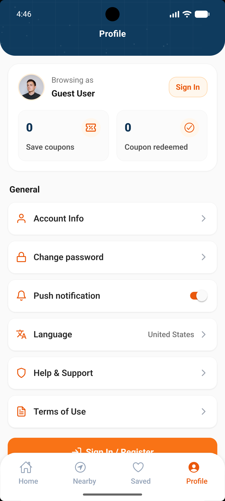

# CityDeals

CityDeals is a modern mobile coupon and deals discovery application built with Expo (SDK 57), React Native, TypeScript, and NativeWind (Tailwind CSS). The application allows users to discover local discounts, browse deals by category and proximity, save favorites, share deals across platforms, and redeem coupons in-store.

---

## App Preview

|                                     Demo                                     |                                Screen 1                                 |                                Screen 2                                 |                                Screen 3                                 |                                Screen 4                                 |
| :--------------------------------------------------------------------------: | :---------------------------------------------------------------------: | :---------------------------------------------------------------------: | :---------------------------------------------------------------------: | :---------------------------------------------------------------------: |
|  |  |  |  |  |

---

## Features

- Multi-Language Selection: Choose between United States, Spain, and Portugal languages with quick switching from profile settings.
- Onboarding Experience: Interactive swipeable walkthrough highlighting core discount features.
- Guest Browsing: Users can explore deals, browse categories, filter by radius, and view store information without signing up first.
- Collapsible Sticky Header: Smooth 60fps native animated search bar on the home feed that minimizes on scroll up.
- Category and Search Filtering: Real-time keyword filtering across headings, descriptions, and category tags.
- Proximity & Distance Filters: Explore local deals with customizable distance radius chips.
- Saved Coupons Feed: Store and manage favorite coupons with immediate heart toggles.
- Coupon Redemption System: Gated redemption workflow requiring authentication, generating unique coupon codes and scannable QR codes for in-store checkout.
- Multi-Platform Sharing: Native sharing to Email, SMS, Facebook, Instagram, and TikTok with clipboard copy fallbacks and deep links.
- Profile and Settings: Manage account info, password updates, language preferences, notification toggles, help requests, and terms of use.

---

## Tech Stack

- Framework: React Native with Expo (SDK 57)
- Routing: Expo Router (File-based navigation)
- Styling: NativeWind v4 (Tailwind CSS) with React Native StyleSheet hybrid patterns
- Language: TypeScript
- Icons: Expo Vector Icons (Ionicons, Feather, FontAwesome, FontAwesome6, MaterialCommunityIcons)
- Safe Area & Layout: React Native Safe Area Context, React Native Screens

---

## Project Structure

```
CityDeals/
├── assets/                  # App images, logos, and textures
├── screenshots/             # Application screenshots and demo GIF
├── src/
│   ├── app/                 # Expo Router file-based routes
│   │   ├── _layout.tsx      # Root stack navigation layout
│   │   ├── index.tsx        # Language selection screen
│   │   ├── onboarding.tsx   # Onboarding carousel
│   │   ├── (auth)/          # Authentication routes (login, register)
│   │   ├── (tabs)/          # Bottom tabs (Home, Nearby, Saved, Profile)
│   │   ├── deals/[id].tsx   # Deep link and shared coupon route
│   │   └── screens/         # Nested stack screens
│   │       ├── coupon-details.tsx
│   │       ├── account.tsx
│   │       ├── change-password.tsx
│   │       ├── help-support.tsx
│   │       └── terms-of-use.tsx
│   ├── components/          # Reusable UI components (DealCard, CurvedHeader, PrimaryButton, etc.)
│   ├── config/              # Constants, mock deals, and language options
│   └── providers/           # App providers and AuthProvider context
├── app.json                 # Expo configuration
├── package.json             # Project dependencies and scripts
├── tailwind.config.js       # Tailwind CSS configuration
└── tsconfig.json            # TypeScript configuration
```

---

## Getting Started

### Prerequisites

- Node.js (v18 or higher recommended)
- npm or yarn
- Android Studio (for Android emulator) or Xcode (for iOS simulator, macOS only)
- Physical device with USB debugging enabled (optional)

### Installation

1. Clone the repository:

   ```bash
   git clone https://github.com/xyryc/CityDeals.git
   cd CityDeals
   ```

2. Install dependencies:

   ```bash
   npm install
   ```

---

## Development and Build Commands

### Start Development Server

```bash
npx expo start
```

### Prebuild Native Directories

To generate fresh native iOS and Android project files:

```bash
npx expo prebuild --clean
```

### Run on Device or Emulator

To build and run directly on a connected physical device or running emulator:

```bash
npx expo run --device
```

For platform-specific targets:

```bash
# Android
npx expo run:android --device

# iOS (macOS only)
npx expo run:ios --device
```

### Diagnostics and Health Check

To diagnose project configuration, dependencies, and native setup:

```bash
npx expo-doctor --verbose
```

### TypeScript Validation

To verify static types without emitting build artifacts:

```bash
npx tsc --noEmit
```

---

## License

This project is licensed under the MIT License.
